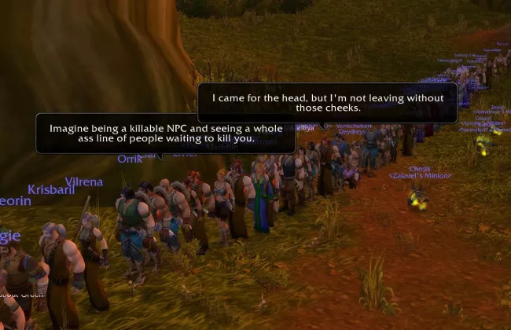
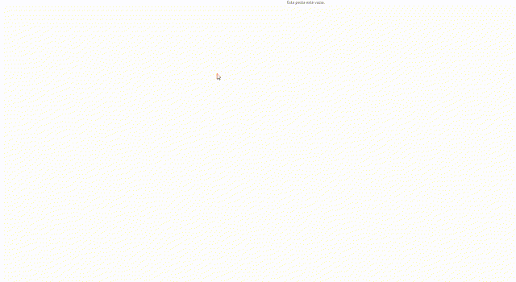
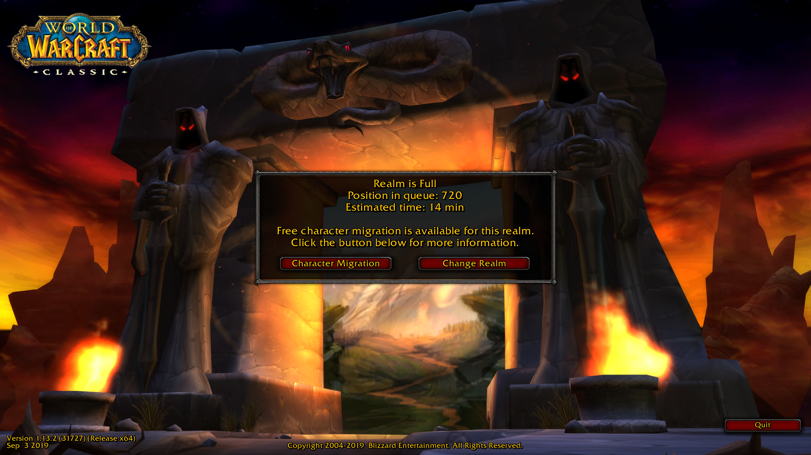

<h1 align='center'>:video_game: IPlayWow :video_game:</h1>

<p align='center'> Never wait in line again for World of Warcraft.</p>
<p align='center'> </p>


## Context - World of Warcraft Nostalgia

By the time the vanilla *World of Warcraft Classic* was revamped, players all over the world seemed to get nostalgic and servers started to get overly crowded and waiting times have hugely increased.  

I was one of the nostalgic ones and also wanted to play. By that time, the only time I had to play WoW was monday and friday's night, as soon as I got back from work. However, whenever I came home around 7 or 8PM, the waiting line was at least 4 hours, which would make me start playing around midnight. 
<p align='center'> </p>

This is a simple project that I made to overcome this problem. I thought it was interesting to upload it to git because maybe it would help someone else. Here you may encounter stuff about `automating windows movements`, (simple) `OCR`, `send whatsapp message`, `handling tokens in public repos`, `logging results` 

## Solution
Of course I got pissed, and my solution was:
- Automate the process of opening `Battle.net` 
- Click on the World of Warcraft Game
- Select the realm and character and `play` at around 5PM
- Take a picture of the screen and send the details (of waiting time) to my whatsapp


## The steps

### Automating Windows - `pyautogui`

The `pyautogui` package was used to manage mouse movement and clicking on Windows. Its use was inspired on the book [Automating the Boring Stuff](https://automatetheboringstuff.com/chapter18/). So for example, after installing pyautogui (`pip install pyautogui`), try to run the following:

```python
from pyautogui import moveTo

moveTo(x=100, y=500, duration=1)
moveTo(x=600, y=500, duration=1)
moveTo(x=600, y=1000, duration=1)
moveTo(x=100, y=1000, duration=1)
moveTo(x=100, y=500, duration=1)
```
and you will see something like:
<p align='center'> </p>

### OCR

The OCR part is really simple. It is almost a fallacy to call this part an OCR. But the idea is simple. There's no way to select the text of the resulting screen (the figure showing the waiting time above). So the idea was to use an `Optical Character Recognition` (OCR) technique to extract the text. 

Although really simple, it is awfully useful. You can extract text from `.png`, `.pdf` and so on with a remarkably good accuracy. 

So I've used the `pyautogui` package itself to store a screenshot of the screen, stored it on folder called `screenshots/` with a [timestamp](https://www.unixtimestamp.com/) to identify which screenshot we were dealing with and store some backup files.

I've used a package called `pytesseract` to extract the text. (Installing this package may be difficult, try following instructions [on the tesseract page](https://github.com/UB-Mannheim/tesseract/wiki) and [on this youtube video](https://www.youtube.com/watch?v=haHuVAUGY5Y)) 

For an image like the following:


The result of running
```python
import pytesseract as ocr

phrase = ocr.image_to_string(Image.open(f'screenshots/stallag_queue_20190908_220646.png'), )
phrase
```
is

```
"OCLASSICO\n\n \n\n \n\n/ Realm is Full\nPosition in queue: 720\nEstimated time: 14 min\n\n \n \n  \n \n   \n  \n     \n\nFree character migration is available for this realm.\nClick the button below for more information.\n\n \n\n   \n\nL Character Migration “J L Change Realm ‘J\n\n \n\n \n\n \n\n \n\n \n\n \n\nfl —-\n\nl\n\nlv'ersion l '1K3‘2‘ffi3'i 752%) (Reigease “3;“\n‘w\n\n7 Sep 3 2019 opyright 200472019 Blizzard Entertainment. All]"
```
and, thus, both position and time in queue can be captured using a simple Regular Expression (regex).

```python
import re

position_queue = re.findall('Position in queue: \d+', phrase)
estimated_time = re.findall('Estimated time: \d+ \w+', phrase)
```


### Handling Tokens 

- TODO: `.env`

### Logging

-TODO: `logging to files` 

### Send Whatsapp Message - Twillio

- TODO: `Twillio setup`

# Important stuff

## Acknowledgements

- [Automating the Boring Stuff](http://automatetheboringstuff.com/) for the inspiration 
- [pytesseract instalation tutorial](https://www.youtube.com/watch?v=haHuVAUGY5Y)


## Songs listened while programming :musical_score:

- [I Play Wow](https://www.youtube.com/watch?v=ltM5jHIJFw4) 
- [Don't make me get my main](https://www.youtube.com/watch?v=TR7FC-h0Fb8)


